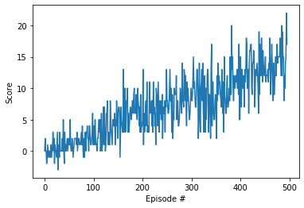

# Report


### Learning Algorithm

### 1.
Deep Q Learning algorithm as described in [DQN paper](https://storage.googleapis.com/deepmind-media/dqn/DQNNaturePaper.pdf) is used. Vector of state is used instead of an image, so convolutional neural nework is replaced with deep neural network. The deep neural has three fully connected layers:

* Layer 1 - Fully connected layer - input: 37 (state size) output: 64
* Layer 2 - Fully connected layer - input: 64 output 64
* Layer 3 - Fully connected layer - input: 64 output: (action size)

Parameters used in DQN algorithm:

* Starting epsilion(starting value of epsilon, for epsilon-greedy action selection): 1.0
* Ending epsilion(minimum value of epsilon): 0.01
* Maximum steps per episode(maximum number of timesteps per episode): 1000
* Epsilion decay rate( multiplicative factor (per episode) for decreasing epsilon): 0.995


### 2.
Agent class Interacts with and learns from the environment

Function __init__ initializes an Agent object, by initializing two identical neural networks.

Function step saves experience in replay memory, by adding data to replay buffer.

Function act returns actions for given state as per current policy, by obtaining actiion_values from self.qnetwork_local and checking eps which is responsible for exploration and exploitation ratio. If the value is greater then eps then maximum value from action_values(exploitation) is used, if not, the choice is random from action space.

Function learn updates value parameters using given batch of experience tuples. Q_targets_next gets max predicted Q values (for next states) from target model. Q_targets computes Q targets for current states. Gamma is a discount factor that makes future rewards less significant. calculate Q_expected gets expected Q values from local model. Optimisation helps Q_expected and Q_targets to come closer.

Function soft_update performs soft update model parameters, by coping parameters from q_network_local and q_network_target according to tau coefficient to `q_network_target.
        θ_target = τ*θ_local + (1 - τ)*θ_target


### 3. 
ReplayBuffer is a fixed-size buffer to store experience tuples. Its purpose is to keep history of different states, actions, rewards, next states and dones. add function adds data from the agent to the replay buffer. sample function gets random sample of data for the agent. We use random sample because we don't want our agent to memorize sequences.

### 4.
Tuning hyperparameters.

BUFFER_SIZE = int(1e5) - buffer size parameters.

BATCH_SIZE = 64 - batch size controls how often our neural network updates gradients.

GAMMA = 0.99 - is the discount factor (0≤γ≤1) - determines how much importance we want to give to future rewards. A high value for the discount factor (close to 1) captures the long-term effective award, whereas, a discount factor of 0 makes our agent consider only immediate reward, hence making it greedy.

TAU = 1e-3 - soft update of target parameters
LR = 5e-4 - is the learning rate (0<α≤1) - Just like in supervised learning settings, α is the extent to which our Q-values are being updated in every iteration.

UPDATE_EVERY = 4 - how often our network updates.


### Results


```python
scores = dqn()
```

    Episode 100	Average Score: 1.05
    Episode 200	Average Score: 4.62
    Episode 300	Average Score: 7.12
    Episode 400	Average Score: 9.40
    Episode 496	Average Score: 13.00
    Environment solved in 396 episodes!	Average Score: 13.00


### Plot the scores


```python
import matplotlib.pyplot as plt
%matplotlib inline
fig = plt.figure()
ax = fig.add_subplot(111)
plt.plot(np.arange(len(scores)), scores)
plt.ylabel('Score')
plt.xlabel('Episode #')
plt.show()
```





### Ideas for future work

 Ideas for improving the agent's performance.
 
I can turn our hyperparameters pragramatically by creating a comprehensive search function (similar to grid search) that selects the parameters that would result in best reward/step ratio. The reason for reward/step is that we want to choose parameters which enable us to get the maximum reward as fast as possible. We also can track number of penalties corresponding to the hyperparameter value combination, because it could be a deciding factor. We can try to get the right combination of hyperparameter values would be to use [Genetic Algorithms](https://towardsdatascience.com/deep-neuroevolution-genetic-algorithms-are-a-competitive-alternative-for-training-deep-neural-822bfe3291f5)

I can try different learning algorithms. I can try: 

Double DQN (Double Q-Learning helps with overestimating action values); 

Prioritized Experience Replay (Prioritized experienced samples more important transitions with higher probability.);

Dueling DQN (Dueling architecture allows to assess the value of each state, without having to learn the effect of each action.)


```python

```
